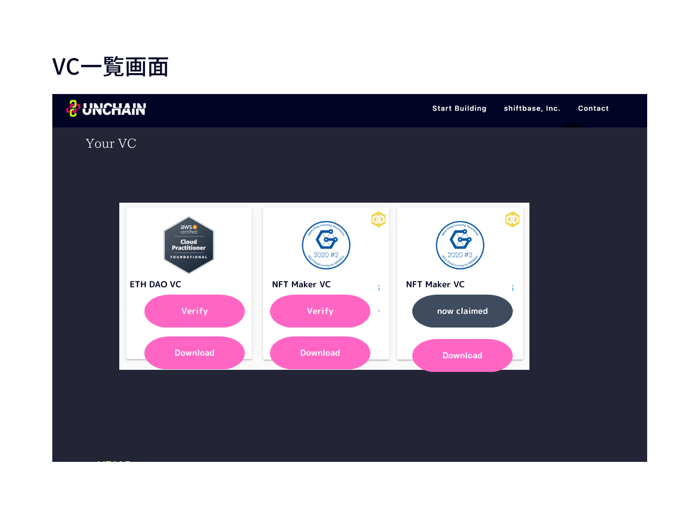

# フロントエンド仕様書

## 画面一覧

| No. | 画面名      | 概要                             |
| --- | ----------- | -------------------------------- |
| 1   | VC 発行画面 | VC を発行するための画面          |
| 2   | VC 検証画面 | VC を検証するための画面          |
| 3   | VC 一覧画面 | 発行済み VC を表示するための画面 |
| 4   |             |                                  |

## 各画面イメージ

各画面イメージ

[【Canva】イメージの元資料](https://www.canva.com/design/DAFYZdxJIl8/1ZWS3RlzENLtkgD8m5ny5A/edit?utm_content=DAFYZdxJIl8&utm_campaign=designshare&utm_medium=link2&utm_source=sharebutton)

### VC 発行画面

### VC 検証画面

### VC 一覧画面

