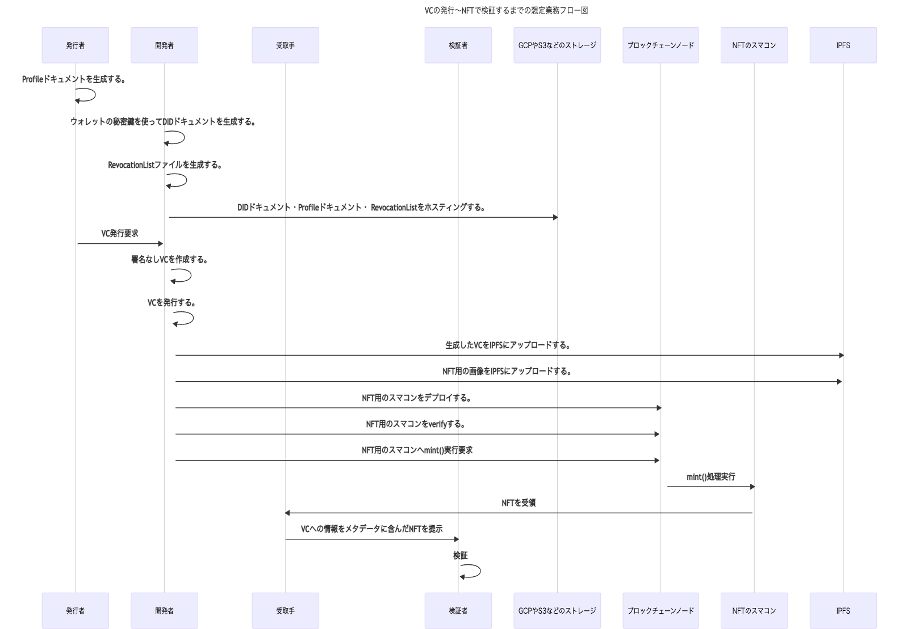

# VC 発行手順

### 環境について

mashharuki の環境では以下のバージョンで VC までの発行を確認してます。

```bash
yarn --version 1.22.17
node --version v18.12.1
npm --version 8.19.2
Python 3.9.13
```

### 事前準備

1. `cert-issuer`をインストールしておくこと。
2. `keys/key_file.txt`に MetaMask の秘密鍵を格納すること
3. バケット名を決めておくこと
4. `conf.ini`の中身を各自の環境に合うように設定すること。

- `cert-issuer`のインストールについて

[cert-issuer のインストール](https://zenn.dev/tatsuyasusukida/articles/issuing-ethereum-certificates-using-blockcerts#cert-issuer-%E3%81%AE%E3%82%A4%E3%83%B3%E3%82%B9%E3%83%88%E3%83%BC%E3%83%AB)を参考にすると良いです！

- `cert-issuer`が正常にインストールされているかチェックするコマンド

```bash
cert-issuer  -h
```

下記の様にコンソールに出力されれば OK！

```bash
--blockcypher_api_token BLOCKCYPHER_API_TOKEN
                        the API token of the blockcypher broadcaster [env var: BLOCKCYPHER_API_TOKEN] (default: None)
  --context_urls CONTEXT_URLS [CONTEXT_URLS ...]
                        When trying to sign a document with an unsupported context, provide the url and the path to the local context
                        file.Space separated list, must be used in conjunction with the `--context_file_paths` property. [env var:
                        CONTEXT_URLS] (default: None)
  --context_file_paths CONTEXT_FILE_PATHS [CONTEXT_FILE_PATHS ...]
                        When trying to sign a document with an unsupported context, provide the url and the path to the local context file.
                        Space separated list, must be used in conjunction with the `--context_urls` property. Path should be relative to CWD,
                        order should match `--context_urls` order. [env var: CONTEXT_FILE_PATHS] (default: None)
```

- `conf.ini`の中身については、`conf.ini.sample`を参照にしながら設定すること

```bash
issuing_address=<YOUR_ADDRESS>
verification_method=did:web:#######.storage.googleapis.com#key-1
usb_name=.
key_file=./keys/key_file.txt

unsigned_certificates_dir=./data/unsigned_certificates
blockchain_certificates_dir=./data/blockchain_certificates
work_dir=./data/work

chain = ethereum_goerli
goerli_rpc_url = https://eth-goerli.g.alchemy.com/v2/####

no_safe_mode
```

### JWK 形式の公開鍵情報を生成する。

```bash
yarn convert
```

生成された内容を`did.json`の`publicKeyJwk`のところに貼り付ける。

```json
{
  "@context": ["https://www.w3.org/ns/did/v1"],
  "id": "did:web:blockcerts-20230113.storage.googleapis.com",
  "service": [
    {
      "id": "#issuer-profile",
      "type": "IssuerProfile",
      "serviceEndpoint": "https://blockcerts-20230113.storage.googleapis.com/profile.json"
    }
  ],
  "verificationMethod": [
    {
      "id": "#key-1",
      "controller": "did:web:blockcerts-20230113.storage.googleapis.com",
      "type": "EcdsaSecp256k1VerificationKey2019",
      "publicKeyJwk": {
        "kty": "EC",
        "crv": "K-256",
        "x": "OHmMFsX67nr0mWHdZLNQMwu4P59RigMgrIwQ5vftVug",
        "y": "IURb-5IMAAa2LW-KgjwULTP7SnsUBdmbrMY0s6FwpLA"
      }
    }
  ]
}
```

### 発行者を証明するための profile.json ファイルを作成する。

```json
{
  "@context": [
    "https://w3id.org/openbadges/v2",
    "https://w3id.org/blockcerts/v3"
  ],
  "id": "https://blockcerts-20230113.storage.googleapis.com/profile.json",
  "type": "Profile",
  "name": "mashharuki",
  "url": "https://www.resume.id/haru28675#_=_",
  "email": "blockcerts@gmail.com",
  "publicKey": [
    {
      "id": "ecdsa-koblitz-pubkey:0x51908F598A5e0d8F1A3bAbFa6DF76F9704daD072"
    }
  ]
}
```

### GCP にバケットを作成し、そこにファイルを格納する。

```bash
yarn create:bucket
```

```bash
google_storage_bucket.my_bucket: Creating...
google_storage_bucket.my_bucket: Creation complete after 2s [id=blockcerts-20230113]
google_storage_bucket_iam_binding.public_rule: Creating...
google_storage_bucket_object.profile: Creating...
google_storage_bucket_object.did: Creating...
google_storage_bucket_object.did: Creation complete after 1s [id=blockcerts-20230113-.well-known/did.json]
google_storage_bucket_object.profile: Creation complete after 1s [id=blockcerts-20230113-profile.json]
google_storage_bucket_iam_binding.public_rule: Creation complete after 5s [id=b/blockcerts-20230113/roles/storage.legacyObjectReader]

Apply complete! Resources: 4 added, 0 changed, 0 destroyed.
✨  Done in 19.68s.
```

うまくいけばアップロードされてネットから見れる様になる。  
今回は下記 URL

- [https://blockcerts-20230113.storage.googleapis.com/.well-known/did.json](https://blockcerts-20230113.storage.googleapis.com/.well-known/did.json)

- [https://blockcerts-20230113.storage.googleapis.com/profile.json](https://blockcerts-20230113.storage.googleapis.com/profile.json)

### Un Signed VC の生成

```bash
yarn generate:unsignedvc
```

うまくいけば`data/unsigned_certificates/sample.json`が生成されている。

### VC の発行

```bash
yarn issue:vc
```

うまくいけば、`data/blockchain_certificates/my_certificate.json`が生成され、proof を含んだ形となる。

```json
{
  "@context": [
    "https://www.w3.org/2018/credentials/v1",
    "https://w3id.org/blockcerts/v3"
  ],
  "id": "urn:uuid:bbba8553-8ec1-445f-82c9-a57251dd731c",
  "type": ["VerifiableCredential", "BlockcertsCredential"],
  "issuer": "did:web:blockcerts-20230113.storage.googleapis.com",
  "issuanceDate": "2023-01-04T00:00:00Z",
  "credentialSubject": {
    "id": "did:example:ebfeb1f712ebc6f1c276e12ec21"
  },
  "proof": {
    "type": "MerkleProof2019",
    "created": "2023-01-13T20:30:17.823175",
    "proofValue": "z7veGu1qoKR3AS5AYzFRX2cJXF4ajmeuQT8Xu32oMMcCRLbFAT7kLp8WhV1i4qBSqHyYvXt4pVVEcwSGiL6C5i3L35Ce7G6MjsJeWe8rNEzyNY6VA1mWk7sQoYk9bvzTkX2cB91EncaEKo7d9fjigJgWT7LqNU1BV5FmEbyAWasVLkd6Ji5wR6JVU428hyFY8WxJ8A3hVPyNk5bV76Ph9EEfvdh9zxaUntjnqf1bhaafhc9XvV898e2AeTzoxb8k6uGyg6aDkozon2moMwqT63inK26Lh27kDhnVZKjWfCjGpmFrEb4g9Y",
    "proofPurpose": "assertionMethod",
    "verificationMethod": "did:web:blockcerts-20230113.storage.googleapis.com#key-1"
  }
}
```

## VC 発行の想定フロー


