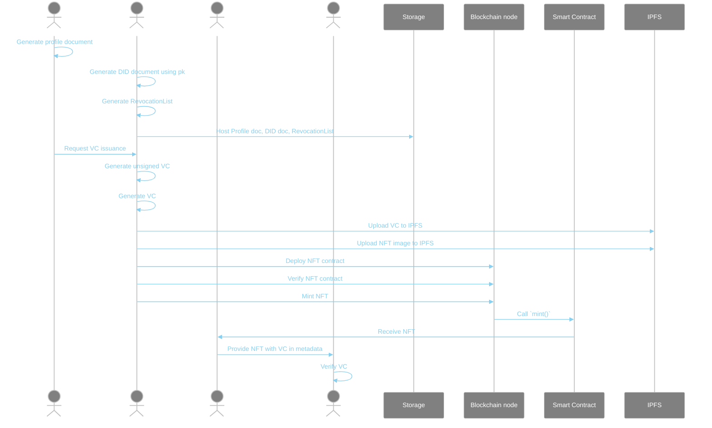

# Sequence diagram (2023-01-19)

```mermaid
%%{init:{'theme':'base','themeVariables':{'textColor':'#89CFF0','primaryColor':'#808080','primaryBorderColor': '#C0C0C0','primaryTextColor':'#FFFFFF'}}}%%

sequenceDiagram
    actor A as Issuer
    actor D as Developer
    actor R as Recipient
    actor V as Verifier
    participant S as Storage
    participant BN as Blockchain node
    participant SC as Smart Contract
    participant DS as IPFS

    A->>A: Generate profile document
    D->>D: Generate DID document using pk
    D->>D: Generate RevocationList
    D->>S: Host Profile doc, DID doc, RevocationList
    A->>D: Request VC issuance
    D->>D: Generate unsigned VC
    D->>D: Generate VC
    D->>DS: Upload VC to IPFS
    D->>DS: Upload NFT image to IPFS
    D->>BN: Deploy NFT contract
    D->>BN: Verify NFT contract
    D->>BN: Mint NFT
    BN->>SC: Call `mint()`
    SC->>R: Receive NFT
    R->>V: Provide NFT with VC in metadata
    V->>V: Verify VC
```
